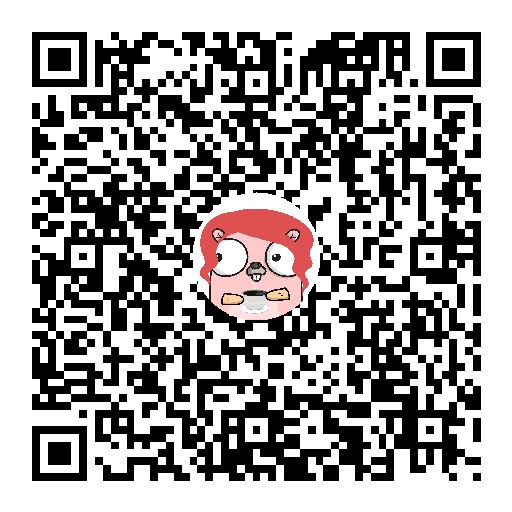

# QR CLI with Gopher Overlay

A command-line tool to generate QR codes with a gopher mascot overlay, written in Go using [Bubble Tea](https://github.com/charmbracelet/bubbletea) for interactive input.

The app collects user information and generates a QR code as a PNG.

---

## Features

- Interactive CLI using Bubble Tea
- Collects **Name**, **Site**, and **Notes**
- Generates a **512×512 PNG QR code**
- Overlays a **gopher image** at the center
- High error correction ensures QR remains scannable even with an overlay

---

## Installation

### Prerequisites

- Go 1.21+
- Terminal capable of displaying UTF-8 (for ASCII QR)
- Generate your own gopher here: https://gopherize.me/
   - Save it to `imgs/default.png` in the working directory.
### Install

```bash
git clone https://github.com/ikristina
cd qr_gopher
go build -o qrcli
```

Run the CLI:

```bash
./qrcli
```

---

## Usage

1. Enter your **name**
2. Enter a **site URL**
3. Enter optional **notes**
4. After the last input, the program generates:
   - `output.png` with the QR code and gopher overlay

Example output:

```
QR code generated → output.png
```



---

## Technical Details

### Architecture

The app is structured using **The Elm Architecture** via Bubble Tea:

1. **Model** – stores program state:
   - Current step (`askName`, `askSite`, `askNotes`, `done`)
   - Collected inputs (`name`, `site`, `notes`)
   - Generated QR ASCII string
   - Errors, if any

2. **Update function** – handles key events:
   - `Enter` → saves input and transitions state
   - `Ctrl+C`/`Esc` → quits
   - When reaching `done`, generates QR code PNG and ASCII

3. **View function** – renders the terminal UI based on the current state.

4. **Commands (`tea.Cmd`)** – used for cursor blinking; Bubble Tea handles repeated calls to `Update` via its event loop.

---

### QR Code Generation

- Uses [`skip2/go-qrcode`](https://github.com/skip2/go-qrcode) to generate a **512×512 PNG**.
- Overlay is applied using Go’s standard library:
  - `image` → represents the QR and gopher images
  - `image/draw` → composites the gopher on top of the QR
- Gopher is resized to **25% of QR size** and placed at the center.
- High error correction (`qrcode.Highest` in PNG, `qrterminal.H` in ASCII) ensures scannability even with the overlay.


---

### File Structure

```
qr_gopher/
|imgs/              # Overlay mascot png file(s)
├── main.go         # Bubble Tea CLI app
├── output.png      # Generated QR (after running)
└── README.md       # Documentation
```
